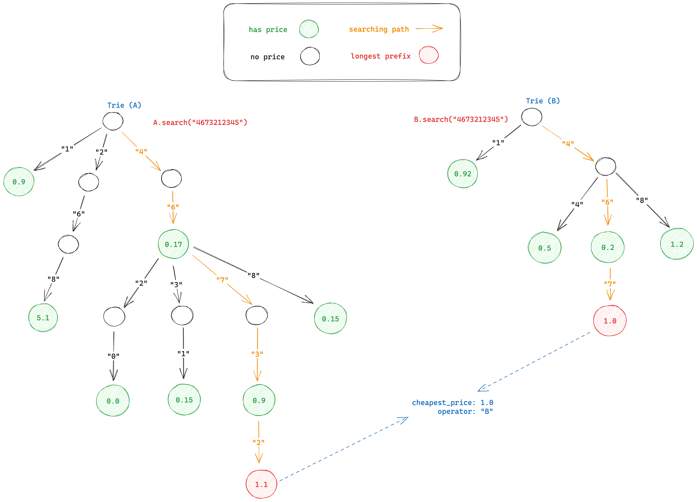
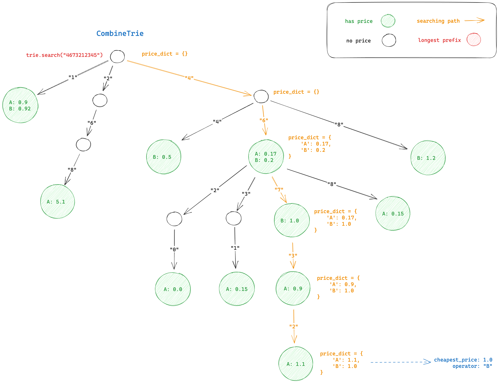

# callrouter

The programming exercise with valuechecker{dot}ai

* Challenge: https://docs.google.com/document/d/1t8BSicFnJellmzg2tBNoAL4hoes3hkyBljowWbBeVrg/edit
* Start date: 8/4/2023
* Deadline: 8/10/2023

## Intuition

This challenge is similar with the autocomplete searching problem using trie. Intuitively, trie (maybe) is a good fit
data structure to solve this challenge.

We can use a bruteforce approach to determine the answer, however, using a certain data structure, I believe there will
be a more efficient solution.

## Approach

### #1

Very first idea, we can build a trie to store price list for each operator. With a certain phone number needs routing,
using the trie to search the price of the longest matching prefix with it.

Do the same for all the remaining operators, then compare the results to find out which operator has the cheapest price,
and how much the cheapest is.

### #2

Having many trie objects and doing search on all trie is not really efficient, both in time and space complexity. It
would be better if we have only one trie object to manipulate.

In combined trie, each node in trie will store a hashmap of `<operator: price>`.

With a certain phone number, traverse the nodes until it reaches the leaf node, browse the nodes until reaching
the leaf node, at each step, save the most recent price of each operator (if any).

In the end, we have a **hashmap** that stores the prices of all the operators whose prefix matches that phone number.
The last thing is to determine which price is the cheapest in this **hashmap**.

## Discussions

- If we just have only one process and one thread program, the **appr#2** can reduce memory to store trie object, we
  also need only one searching operation (per phone number) to determine the cheapest price. So that, it's really better
  than **appr#01**.
- In both approaches, multithreading does not help speed up the program, because it's **CPU bound** task and limitation
  of Python **GIL** (Global Interpreter Locking).
- With single request, using **appr#1** we have a good chance to run the program in parallel for a part of program,
  taking advantage of the cpu with many cores, each trie and search operation on it (for a certain operator) can be
  handled by a completely separate process. Or imagine a scenario using **map-reduce architecture** if the problem needs
  to scale indefinitely.
- If we need to handle a large number of phone number routing requests simultaneously, the **appr#02** is a good
  candidate by using multiprocessing, each call routing request will be handled by a separate process.
